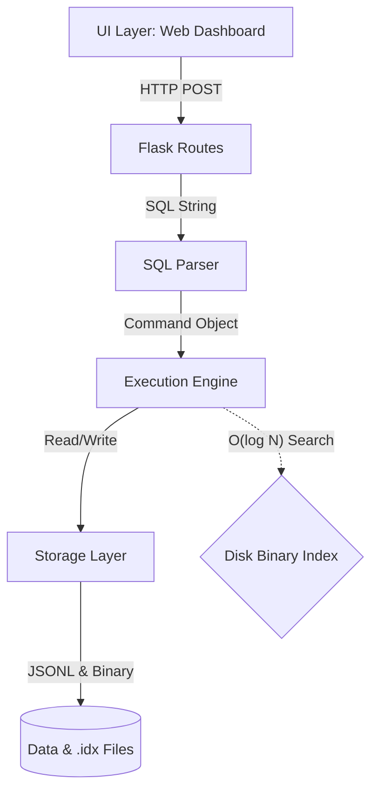

# MiniDB: A Custom RDBMS from First Principles

**MiniDB** is a lightweight, relational database engine built from scratch in Python. It was designed to demonstrate core database internals—including Disk-Based Binary Indexing (O(log N)), Hash Joins, and Atomic Persistence—without relying on external database libraries like SQLite.

> **Note:** This project was built for the **Pesapal Junior Dev Challenge '26**.

## 🏗️ Architecture Overview

The system is organized into four modular layers, designed to mimic a production RDBMS:



- **UI Layer**: A Flask-based Admin Dashboard (`app.py`) with a premium, independent-scrolling layout for schema management, data entry, and SQL execution.
- **SQL Parser**: A regex-based engine (`parser.py`) supporting `CREATE`, `INSERT`, `SELECT` (with aggregates & subqueries), `UPDATE`, `DELETE`, and `JOIN`.
- **Database Engine**: The query coordinator (`database.py`). Implements $O(N)$ Hash Joins, SQL Aggregate Functions, and recursive subquery resolution.
- **Storage Layer**: Handles persistence (`table.py`). Uses **JSON Lines (.jsonl)** for streaming I/O and **Binary Search Indexes (.idx)** for memory-efficient lookups.

## 🧠 Key Engineering Decisions

### 1. Scalability: JSON Lines (.jsonl) Storage
Unlike standard JSON arrays which require loading the entire file into memory, MiniDB uses JSON Lines:
- **Streaming Scans**: Rows are yielded one-by-one using Python generators, keeping memory usage constant even for million-row tables.
- **O(1) Persistence**: New records are appended to the end of the file instead of rewriting the entire dataset.

### 2. Efficiency: Disk-Based Binary Indexing (O(log N))
To solve the "Memory Residency" limitation, MiniDB implements a custom disk-persistent binary index:
- **Binary Search on Disk**: Primary keys and file offsets are stored in `.idx` files as fixed-size binary records. 
- **O(1) Memory Footprint**: Instead of loading a massive hash map into RAM, the engine performs a **Binary Search** directly on the disk file to locate rows.
- **Ordered Maintenance**: The Indexer maintains sort order during insertions, enabling efficient $O(\log N)$ point lookups without expensive memory overhead.

### 3. Performance: Hash Joins over Nested Loops
Naive database implementations use Nested Loop Joins ($O(N \times M)$). MiniDB implements a Hash Join algorithm:
- **Build Phase**: Constructs an in-memory Hash Map of the smaller table.
- **Probe Phase**: Scans the larger table and performs $O(1)$ lookups against the map.
- **Result**: Reduces join time from linear growth to near-constant time for lookups.

### 4. Intelligence: SQL Aggregates & Subqueries
MiniDB supports advanced SQL features usually found in mature engines:
- **Aggregate Functions**: Supports `COUNT`, `SUM`, `AVG`, `MIN`, and `MAX` in a single-pass execution for maximum efficiency.
- **Recursive Subqueries**: Clauses like `WHERE col IN (...)` are resolved recursively before the outer query runs.
- **Strict Validation**: Enforces numeric types for mathematical aggregates (e.g., preventing `SUM` on `STR` columns).

### 5. Reliability: Atomic Writes (Crash Safety)
To prevent data corruption during power failures, MiniDB uses an atomic save strategy:
1. Writes data to a temporary file (`table.tmp`).
2. Forces a hardware flush using `os.fsync`.
3. Performs an atomic swap using `os.replace`.

### 6. Consistency: ACID Transactions
MiniDB implements a robust Transaction Manager within the engine:
- **Staging Area**: Changes during a transaction are kept in a session-specific buffer.
- **Atomicity**: Supports `BEGIN`, `COMMIT`, and `ROLLBACK` for multi-statement workflows.

### 7. Concurrency: Multi-Process File Locking
Leverages a global `LockManager` with pessimistic file-based locks to prevent race conditions during concurrent write operations across multiple processes.

## 🚀 How to Run

### Installation
1. Clone the repository:
   ```bash
   git clone https://github.com/colloceo/MiniDB.git
   cd MiniDB
   ```
2. Install dependencies: `pip install -r requirements.txt`

### Running the App
1. Start the Web Admin Dashboard: `python app.py` (Visit `http://127.0.0.1:5000`)
2. CLI mode: `python main.py`

## 🙏 Acknowledgements
This project was built as part of the Pesapal Junior Dev Challenge '26.
- **Architecture & Logic**: Designed by Collins Odhiambo.
- **Code Generation & Optimization**: AI (Gemini 2.0) assisted in developing regex patterns, refactoring algorithms, and generating premium UI components.

Built with code, sweat, and Python.
