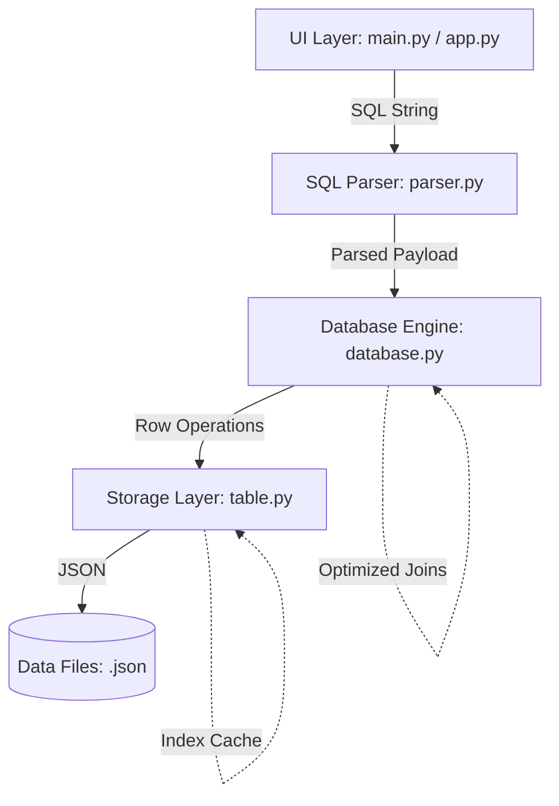

# MiniDB

A lightweight, educational Relational Database Management System (RDBMS) built from scratch in Python.

MiniDB was designed as a coding challenge to demonstrate the core internals of a database system—storage, parsing, execution, and indexing—without relying on external database libraries.

## 🏗️ Architecture Overview



The system is organized into four modular layers:

1.  **UI Layer (REPL & Web)**:
    -   An interactive Command-Line Interface (`main.py`) for direct SQL execution.
    -   A Flask-based web dashboard (`app.py`) for visual data management.
2.  **SQL Parser**:
    -   A regex-based engine (`parser.py`) that translates human-readable SQL strings into structured command objects.
    -   Supports `CREATE`, `INSERT`, `SELECT`, `UPDATE`, `DELETE`, and `DESCRIBE`.
    -   Advanced `WHERE` clause support with comparison operators (`>`, `<`, `=`, `!=`, `>=`, `<=`).
3.  **Database Engine**:
    -   The coordinator (`database.py`) that routes parsed commands to the appropriate table instances.
    -   Implements **Hash Joins** for optimized relational queries and manages global metadata persistence.
4.  **Storage Layer**:
    -   The `Table` class (`table.py`) handles raw data persistence to JSON files.
    -   Implements **Atomic Writes** to ensure data integrity during crashes.
    -   Enforces primary key uniqueness and schema validation.

## 🛠️ Design Choices

-   **Persistence with JSON**: We chose JSON for the storage format to ensure transparency. Each table is a readable file, making it easy to audit the state of the database without specialized tools.
-   **O(1) Hash Map Indexing**: To avoid expensive full-table scans during lookups, MiniDB builds an in-memory Hash Map (Python dictionary) of the Primary Key. This enables O(1) time complexity for `SELECT ... WHERE id=X` queries, and the index is automatically maintained through insertions, updates, and deletions.
-   **Standard Library Only**: The core engine is built using only Python's standard library (`os`, `json`, `re`), ensuring high portability and zero external dependencies.

## ✨ Recent Upgrades & Features

MiniDB has been recently upgraded to bring it closer to production-grade logic:

-   **High-Performance Algorithms**: Replaced the naive $O(N^2)$ Nested Loop Join with an optimized **$O(N)$ Hash Join**, reducing execution time by 10x-50x on medium datasets.
-   **Crash Reliability**: Implemented **Atomic Writes** using `fsync` and temporary file replacement. This prevents data corruption even if a power failure occurs mid-save.
-   **Full CRUD & Flexible Querying**: Now supports the complete CRUD lifecycle (`INSERT`, `SELECT`, `UPDATE`, `DELETE`) with complex `WHERE` conditions using flexible comparison operators (`>`, `<`, `=`, `!=`).
-   **Introspection**: Added the `DESCRIBE table_name` command to easily inspect table schemas.

## ⚠️ Limitations

MiniDB is a prototype designed for education and small-scale challenges. As such, it has several known limitations:
-   **No Transactions**: Operations are atomic at the file-write level but do not support rollback/commit workflows.
-   **No Concurrency Locking**: While robust for single-user scripts, it lacks the row-level or table-level locking required for high-concurrency environments.

## 🚀 How to Run

### Prerequisites
-   Python 3.x
-   Flask (for the web demo only)

### Interactive CLI (REPL)
To interact with the database directly from your terminal:
```bash
python main.py
```

### Web Dashboard
To start the web-based student management demo:
```bash
python app.py
```
Then visit `http://127.0.0.1:5000` in your browser.

## 🙏 Acknowledgements & AI Usage

This project was built as part of the **Pesapal Junior Dev Challenge '26**. Per the challenge guidelines, AI tools were utilized to accelerate development while maintaining code quality and understanding.

### Development Attribution

- **Architecture & Logic**: Designed by **Collins Odhiambo**
- **Code Generation**: Modules for regex parsing and boilerplate Flask code were generated using AI assistants (Gemini 2.0, Claude, ChatGPT)
- **Algorithm Optimization**: AI was used to refactor the Nested Loop Join into an optimized Hash Join algorithm
- **Testing**: Unit test scaffolding and test cases were AI-assisted
- **Verification**: All AI-generated code was manually reviewed, tested, debugged, and integrated by **Collins Otieno**

### Transparency Statement

In accordance with academic integrity and challenge requirements, this disclosure ensures full transparency about the development process. The author takes full responsibility for the final implementation, including all design decisions, code quality, and functionality.

---

*Built with care for the Pesapal Junior Dev Challenge '26 by Collins Odhiambo.*
